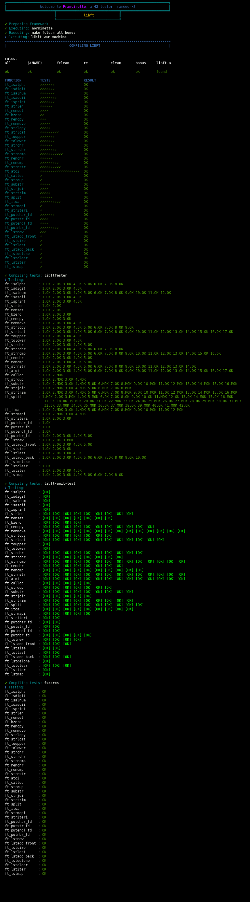

<h2>About: </h2>
  The goal of this project is to rebuild the c standard library, but focusing only on basic functions with some more difficult functions.
  <h4>Note: 125/100 </h4>
<h2>Francinette test:</h2>
<h4>libft-war-machine (https://github.com/y3ll0w42/libft-war-machine)</h4>
<h4>libft-unit-test (https://github.com/alelievr/libft-unit-test)</h4>
<h4>libftTester (https://github.com/Tripouille/libftTester)</h4>
<h4>fsoares (https://github.com/xicodomingues/francinette)</h4>

